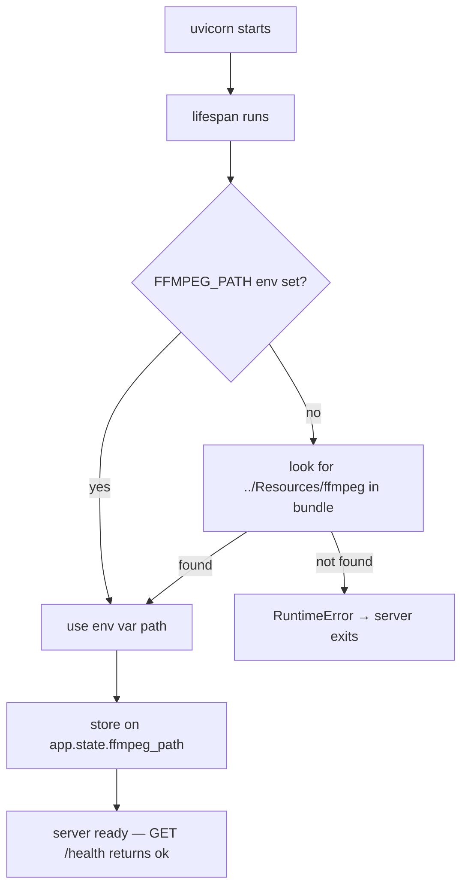
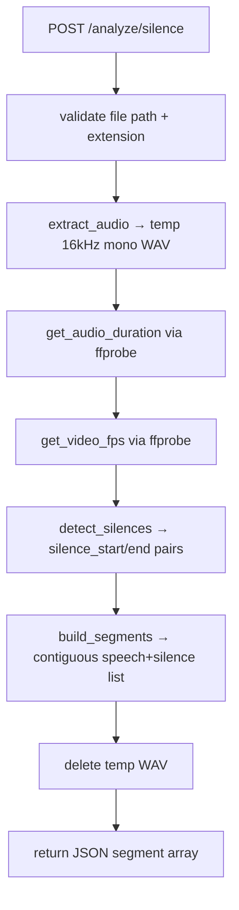
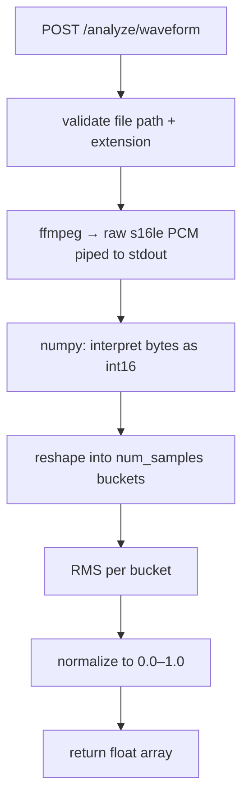
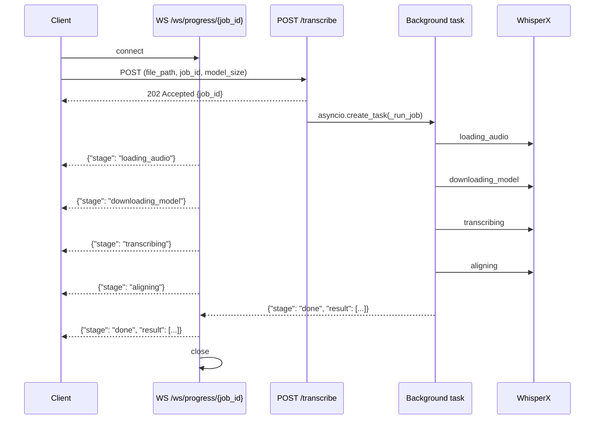

# Backend Architecture

The Talkeet backend is a FastAPI server that handles all compute-heavy work — silence detection, waveform extraction, transcription, and NLE export — while the SwiftUI frontend acts purely as a UI layer. It runs on `localhost:8742`, is launched by the macOS app on startup, and shuts down when the app quits. All processing runs locally: no cloud APIs, no external services.

## Overview

The backend is organized into two clear layers:

- **Routers** (`app/routers/`) — validate HTTP requests, translate between HTTP concerns and service calls, handle error mapping to status codes.
- **Services** (`app/services/`) — pure business logic, synchronous, no FastAPI imports. Each service owns one domain.

A single lifespan hook in [main.py](../../backend/app/main.py) resolves the ffmpeg binary path at startup and stores it on `app.state`, making it available to every request handler without per-request lookup.

```
backend/app/
├── main.py               ← FastAPI app, lifespan, GET /health
├── config.py             ← Settings + ffmpeg path resolution
├── routers/
│   ├── analyze.py        ← POST /analyze/silence, POST /analyze/waveform
│   ├── transcribe.py     ← POST /transcribe, WS /ws/progress/{job_id}
│   └── export.py         ← POST /export/edl, /fcpxml, /premiere, /srt
└── services/
    ├── silence.py        ← Silence detection pipeline
    ├── waveform.py       ← Waveform extraction pipeline
    ├── transcription.py  ← WhisperX transcription pipeline
    └── export.py         ← EDL, FCPXML, Premiere XML, SRT generators
```

## How it works

### Startup



The ffmpeg path is resolved exactly once. If the binary is missing, the server refuses to start. This is intentional: a silent failure on the first request would be much harder to diagnose. See [config.py](../../backend/app/config.py) for the resolution logic.

---

### Silence detection pipeline — `POST /analyze/silence`

This is the primary analysis step. The frontend calls it after a video is dropped in.



Key design decisions in [silence.py](../../backend/app/services/silence.py):

- **Audio is extracted to a temp WAV first**, rather than piped inline, because `silencedetect` needs seekable input. The WAV is deleted in a `finally` block regardless of whether the pipeline succeeds.
- **Asymmetric padding**: each speech interval is expanded backward by `pre_padding` and forward by `post_padding`. The post-padding is clamped to the midpoint between adjacent speech intervals to prevent them from merging.
- **5-frame minimum**: speech segments shorter than `5 / fps` seconds are dropped. This removes alignment artifacts without affecting real speech.
- Silence intervals where the file ends without a closing `silence_end` are represented as `(start, inf)` and clamped to `audio_duration` during segment building.

The output is a flat, contiguous array of `{start, end, type}` objects covering the full file duration with no gaps.

---

### Waveform extraction pipeline — `POST /analyze/waveform`

Used by the frontend timeline (Milestone 7) to render the audio waveform.



Unlike silence detection, **no temp file is written**. The PCM stream is piped directly from ffmpeg stdout into memory, processed with numpy, and returned. This keeps latency low and avoids disk I/O for large files.

The `num_samples` parameter controls resolution. The SwiftUI layer fetches once at high resolution (~8000–10000 samples) and slices the array client-side during zoom/pan — no re-fetching on gesture. See [waveform.py](../../backend/app/services/waveform.py).

---

### Transcription pipeline — `POST /transcribe` + `WS /ws/progress/{job_id}`

Transcription is the only long-running operation (seconds to minutes depending on model size and video length). The design uses a job-based streaming pattern to avoid holding an HTTP connection open.



The in-memory job store (`_jobs: dict[str, asyncio.Queue]`) maps each `job_id` to an `asyncio.Queue`. Progress events from the thread executor reach the queue via `asyncio.run_coroutine_threadsafe` — the only safe way to cross the thread/async boundary. See [transcribe.py](../../backend/app/routers/transcribe.py) for the bridge implementation.

WhisperX always runs on `device="cpu"` — CTranslate2 does not support MPS on Apple Silicon. Models are cached at `~/Library/Application Support/Talkeet/models/` so downloads only happen on first use per model size. See [transcription.py](../../backend/app/services/transcription.py).

If `segments` are provided in the request, words that fall outside those time ranges are filtered out after alignment. Words with `start=None` (alignment failed) are always kept.

---

### Export pipelines — `POST /export/{edl,fcpxml,premiere,srt}`

All four export endpoints share a single `ExportRequest` model and a common validation helper. The only input is the original file path, the segment list from silence detection, and (optionally) the word list from transcription.

```mermaid
flowchart TD
    A[POST /export/*] --> B[validate file + extension]
    B --> C[get_video_info → fps + duration via ffprobe]
    C --> D{format?}
    D -->|edl| E[generate_edl → CMX 3600 text]
    D -->|fcpxml| F[generate_fcpxml → FCPXML 1.11 XML]
    D -->|premiere| G[generate_premiere_xml → xmeml v4 XML]
    D -->|srt| H[generate_srt → SubRip text]
    E & F & G & H --> I{output_path set?}
    I -->|yes| J[write to disk → return written_to path]
    I -->|no| K[stream as download attachment]
```



Only `speech` segments are passed to the generators. Silence segments are discarded at the router level before the service call.

FPS and duration come from `ffprobe` on the source video — not inferred from the segment list — to guarantee timecode accuracy. FCPXML uses rational time fractions (`frames/fps` seconds), Premiere uses integer frame counts, and SRT uses wall-clock milliseconds.

---

## Key design decisions

**ffmpeg is never looked up via PATH.** The app bundles its own ffmpeg binary. Using `shutil.which` in production would silently pick up a system ffmpeg that may be a different version. The explicit resolution order (env var → bundle path) makes the binary deterministic in all environments.

**Services are synchronous; routers are async.** The service layer has no asyncio imports — it is plain Python callable from any context. Long-running services (WhisperX) are pushed to a thread pool via `run_in_executor`. This keeps the event loop free and makes unit testing the service layer straightforward without an event loop.

**Transcription dependency is optional at import time.** `whisperx` is imported inside `transcribe_video` rather than at module top-level. This lets the base server start and serve health checks, silence detection, and waveform endpoints even if the transcription group is not installed.

**Single uvicorn worker, no shared state across processes.** The job store is an in-memory dict. This is safe because the SwiftUI layer always launches exactly one backend process. Running multiple workers would break the WebSocket job routing.

## Related

- [[silence-detection-pipeline]] *(not yet written — candidate for a deeper reference doc)*
- [[transcription-streaming-protocol]] *(not yet written — candidate for a reference doc)*
