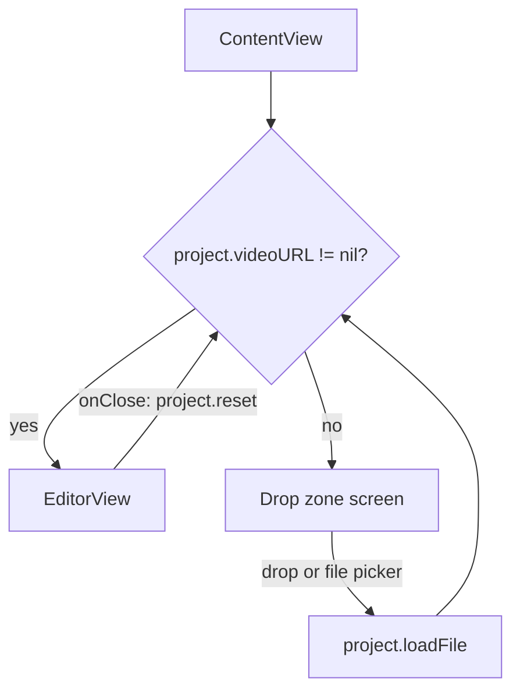
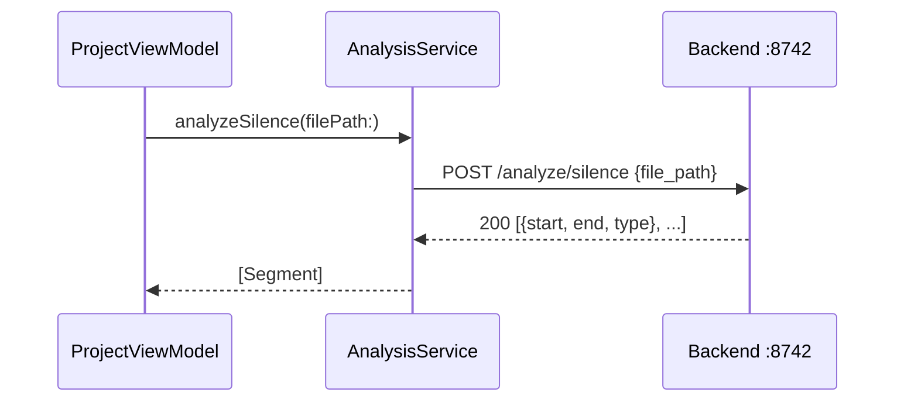
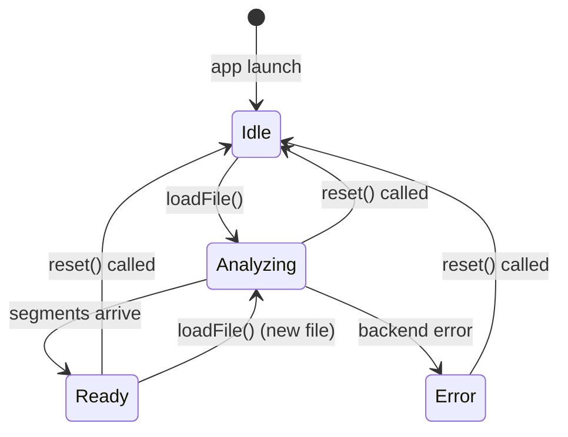

# Frontend Architecture

The Talkeet frontend is a native macOS SwiftUI app that owns all user interaction and video playback, while delegating all compute-heavy work to the Python backend over localhost. It is structured around two runtime singletons — `BackendManager` and `ProjectViewModel` — injected via the SwiftUI environment so any view in the hierarchy can observe them.

## Overview

The app uses Swift 6.2 with the `-default-isolation MainActor` module flag, which means all types in the main target are implicitly `@MainActor` unless annotated otherwise. This eliminates the most common class of data-race warnings in a UI app without requiring explicit `@MainActor` annotations on every type.

```
frontend/Talkeet/Talkeet/
├── TalkeetApp.swift              ← Entry point; owns BackendManager + ProjectViewModel
├── ContentView.swift             ← Top-level router: drop zone ↔ editor
├── Models/
│   └── Segment.swift             ← Codable segment model from /analyze/silence
├── Services/
│   ├── HTTPClient.swift          ← Protocol over URLSession for testable networking
│   └── AnalysisService.swift     ← POST /analyze/silence call
├── ViewModels/
│   └── ProjectViewModel.swift    ← Central state: file URL, AVPlayer, segments, loading/error
└── Views/
    ├── VideoPlayerView.swift     ← AVKit VideoPlayer wrapper
    ├── SegmentListView.swift     ← Scrollable segment list with seek callback
    └── EditorView.swift          ← Editor layout: player + segment sidebar
```

## App lifecycle

`TalkeetApp` owns both singletons as `@State` properties so they live for the full app lifetime. The backend process is started when the scene becomes `.active` and stopped on `.background` or `NSApplication.willTerminateNotification`.

```
TalkeetApp
├── @State backend: BackendManager   ← Manages Python subprocess lifecycle
├── @State project: ProjectViewModel ← Manages video session state
└── ContentView
    ├── .environment(backend)
    └── .environment(project)
```

`ContentView` reads both from the environment. No other view owns or stores these objects directly.

---

## Routing — ContentView

`ContentView` is a pure router with no business logic of its own. It switches between two screens based on whether a video has been loaded:



The drop zone and "Open File…" button are both gated on `backend.status == .ready` — the UI disables them while the backend is still launching. The file picker uses `.fileImporter` with `[.mpeg4Movie, .quickTimeMovie]` content types.

---

## Data model — Segment

`Segment` is the central data type in the app. It maps directly to the JSON returned by `POST /analyze/silence`.

```swift
struct Segment: Codable, Identifiable, Equatable {
    let start: Double   // seconds from video start
    let end: Double
    let type: SegmentType  // .speech | .silence
    var id: Double { start }      // start is unique in a contiguous list
    var duration: Double { end - start }
}
```

The backend guarantees the segment list is contiguous and covers the full video duration with no gaps. The frontend relies on this invariant without re-validating.

---

## Networking — HTTPClient + AnalysisService

All backend communication uses `URLSession`, but the service layer accesses it through the `HTTPClient` protocol so unit tests can inject a mock without a running backend.

```swift
protocol HTTPClient: Sendable {
    func data(for request: URLRequest) async throws -> (Data, URLResponse)
}
extension URLSession: HTTPClient {}
```

`AnalysisService` wraps `POST /analyze/silence`. It encodes the request body with `file_path` in snake_case (to match the Python backend) and decodes the response as `[Segment]`.



On non-200 responses, `AnalysisService` throws `AnalysisError.httpError(statusCode)`. The caller (`ProjectViewModel.runAnalysis`) catches this and sets `errorMessage` for the UI.

URL construction uses `baseURL.appending(path: "analyze/silence")` — not `appendingPathComponent`. The latter silently strips a leading slash; the former is explicit about relative path segments.

---

## Session state — ProjectViewModel

`ProjectViewModel` is the heart of an editing session. It owns the `AVPlayer` and drives the full analysis flow after a file is loaded.

```
loadFile(url)
    ├── cancel previous analysisTask
    ├── set videoURL, player, segments=[], errorMessage=nil, isAnalyzing=true
    └── Task { runAnalysis(url) }
            ├── AnalysisService.analyzeSilence(filePath:)
            ├── on success: segments = result; isAnalyzing = false
            ├── on cancellation: silent (task was superseded)
            └── on error: errorMessage = message; isAnalyzing = false
```

The `defer` in `runAnalysis` only clears `isAnalyzing` when the task was **not** cancelled. If `reset()` or a new `loadFile()` fires while analysis is in flight, they set the flag themselves — the deferred block must not clobber that.

`reset()` cancels any in-flight task and zeroes all session state. It is called from `ContentView` when the user clicks "Close" in `EditorView`.



---

## Views

### EditorView

The editor splits the window into a main video area and a 260pt sidebar:

```
┌─────────────────────────────────────────┬────────────┐
│ toolbar: ← Close   filename.mp4         │            │
├─────────────────────────────────────────│  Segment   │
│                                         │   List     │
│            VideoPlayerView              │            │
│          (AVKit native controls)        │            │
│                                         │            │
└─────────────────────────────────────────┴────────────┘
```

`EditorView` takes `@Bindable var viewModel: ProjectViewModel` and an `onClose: () -> Void` closure. It does not read from the environment — it receives what it needs explicitly, which keeps it previewable in isolation.

### SegmentListView

Displays the segments returned by the backend. The view has four states driven by the three input properties it receives:

| `isAnalyzing` | `errorMessage` | `segments.isEmpty` | Rendered |
|---|---|---|---|
| true | — | — | `ProgressView` + "Analyzing…" |
| false | non-nil | — | Error icon + message |
| false | nil | true | "No segments yet" |
| false | nil | false | Scrollable `List` |

Each row shows a type badge (SPEECH in green, SILENCE in orange), the time range in `MM:SS.mm` format, and the duration. Tapping a row calls `onSeek(segment)` — the view has no reference to `AVPlayer` directly.

### VideoPlayerView

A thin wrapper around `AVKit.VideoPlayer`. Stateless: it renders whatever player it receives, or a placeholder when `player` is `nil`. The player instance is owned by `ProjectViewModel`.

---

## Testing approach

The test target uses Swift Testing (`import Testing`, `@Test`, `#expect`). Because the main target compiles with `-default-isolation MainActor`, all `Talkeet` module types are implicitly `@MainActor`. Test suites that touch these types must be annotated `@MainActor` to satisfy isolation:

```swift
@Suite("SegmentTests")
@MainActor
struct SegmentTests { ... }
```

`ProjectViewModel` and `AnalysisService` are tested without a real backend by injecting `MockHTTPClient` — a `struct` that returns fixed `(Data, URLResponse)` pairs. An `actor RequestCapture` variant captures the outgoing request body to verify the `file_path` JSON key.

## Related

- [[backend-architecture]] — How the FastAPI backend handles /analyze/silence and other endpoints
